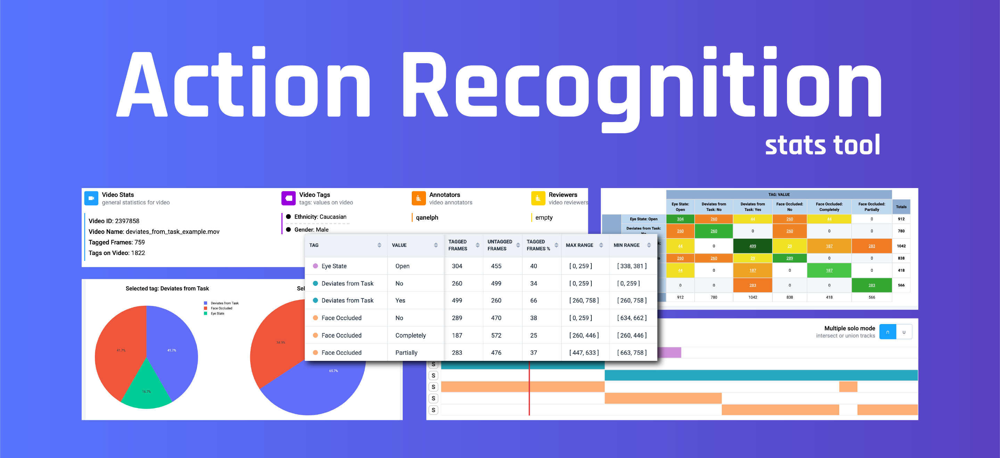
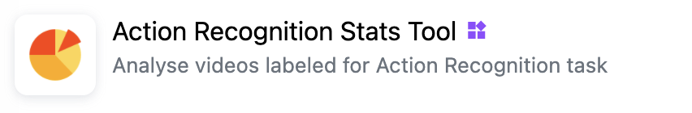
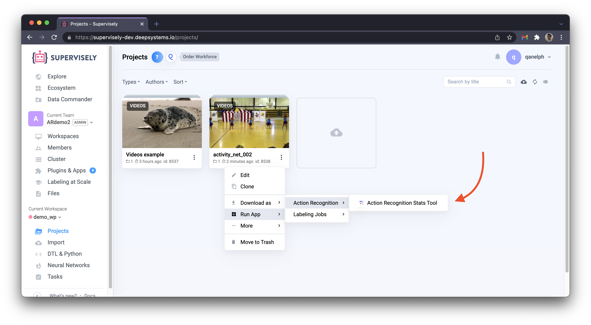
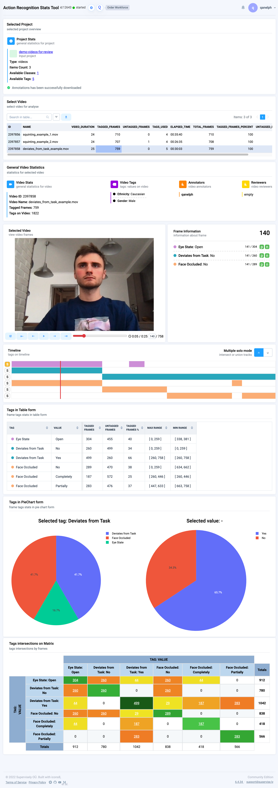

# Action Recognition Stats Tool

  <a href="#Overview">Overview</a> •
  <a href="#How-To-Run">How To Run</a> •
  <a href="#Common-apps">Common Apps</a> •
  <a href="#Demo">Demo</a>
  <a href="#Screenshot">Sceenshot</a>

# Overview

Check all data annotated in Action Recognition task.

Application key points:
- High-level statistics for all videos
- Detailed statistics for selected video
- PowerFull timeline for tags analyse 
- Table, Charts and Matrix to view tags from different angles

# How to Run

### 1. Add [Action Recognition Stats Tool](https://ecosystem.supervise.ly/apps/action-recognition-stats) to your team from Ecosystem.
  

### 2. Run app from the context menu of Videos Project:

# Common Apps

This application cooperate with next Supervisely Applications ⬇️ 

- [Action Recognition Labeling](https://ecosystem.supervise.ly/apps/action-recognition-labeling) — use to label data

    

# Demo

# Screenshot

